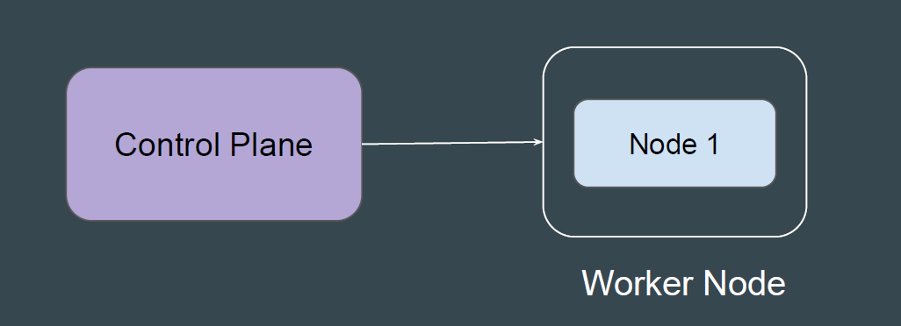
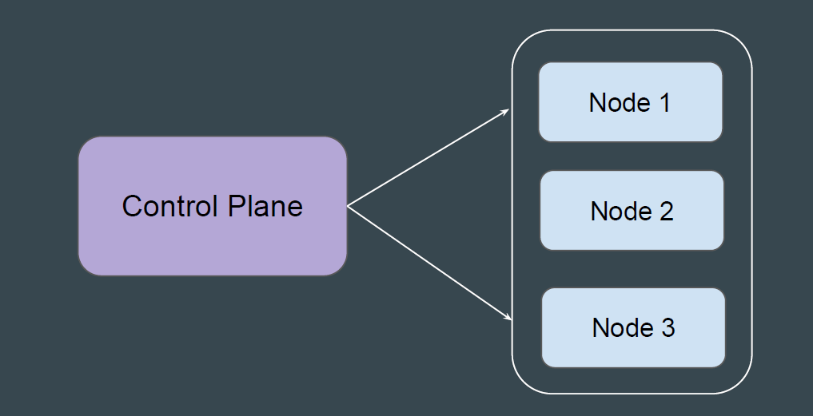
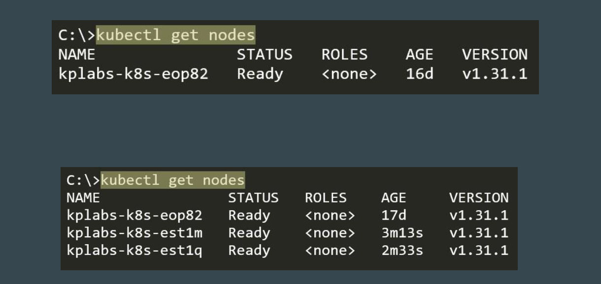

# Multiple Worker Nodes for Kubernetes

A single worker node might not have enough resources (CPU, memory) to
handle the load of all the Pods.

 
 

## Multiple Worker Nodes are Good

Adding more worker nodes allows you to distribute the workload across the
worker nodes.

 
 

Other Benefits of Multiple Worker Nodes
If one worker node fails, the applications running on it will become unavailable.
With multiple worker nodes, Kubernetes can reschedule those applications onto
healthy nodes, ensuring continuous service availability.

## Point to Note - Worker Node Sizes

It is not necessary for ALL worker nodes to have same hardware specification.
Sample Example:

| Worker Node | RAM | CPU |
|------------|-----|-----|
| Worker Node 1 | 2 GB | 2 vCPU |
| Worker Node 2 | 4 GB | 4 vCPU |
| Worker Node 3 | 8 GB | 8 vCPU |

## How to Check Worker Nodes in K8s Cluster

Use the kubectl get nodes command to get list of worker node as part of your
cluster.

 
 

## Point to Note

Depending on the type of environment that was used to create the Kubernetes
cluster, the steps to add multiple worker nodes will change accordingly.
