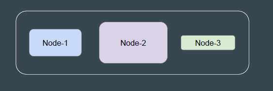
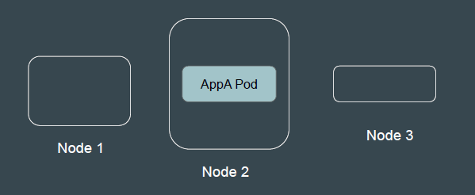

# Node Selector

## Setting the Base

In Kubernetes, different worker nodes can be based on different hardware
specifications.
Some applications would require more CPU and Memory, while some
applications might require minimum compute resource.

 
 

## Understanding the Topic

Node Selector is a mechanism used to control the placement of pods onto
specific nodes within a cluster.
Requirement: AppA Pod requires high memory and CPU. Run it in Big Node.

 
 

## Why Use Node Selectors

1. To ensure certain workloads run on specific nodes with special hardware or

configurations (e.g., GPUs, high-memory nodes).
2. To segregate workloads for compliance, performance, or isolation purposes.
