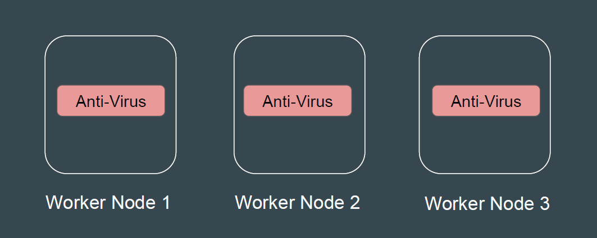

## Setting the Base

A DaemonSet can ensures that all Nodes run a copy of a Pod.
Whenever new nodes are added to the cluster, Pods will be created in them.

 
 

## Common Type of Agents for Daemonset

1. Anti-Virus and Malware Scanning Agents.

2. Log Collection Agents to collect logs from nodes.

3. Monitoring and Metrics Collection Agents to collect metrics about node
